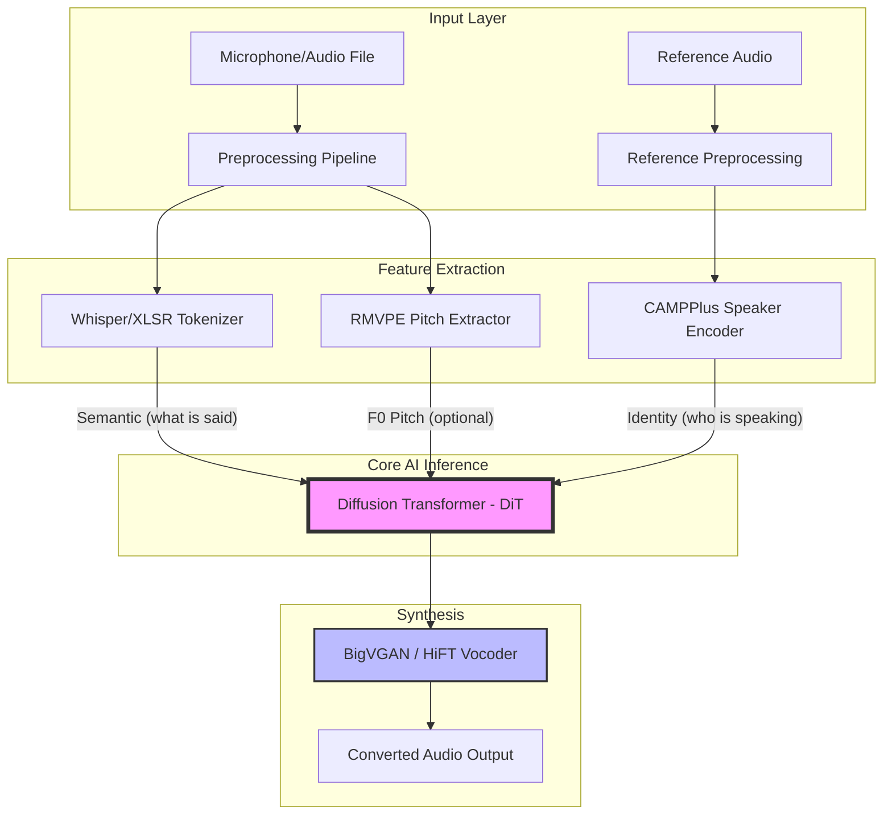
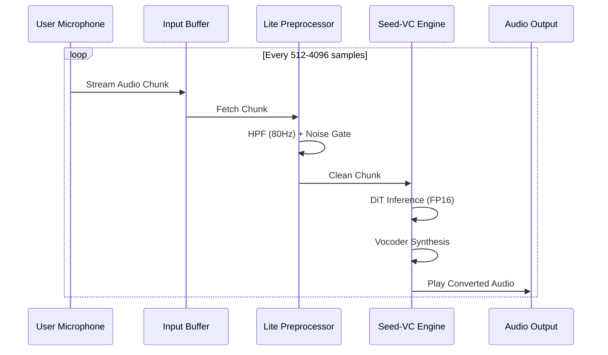
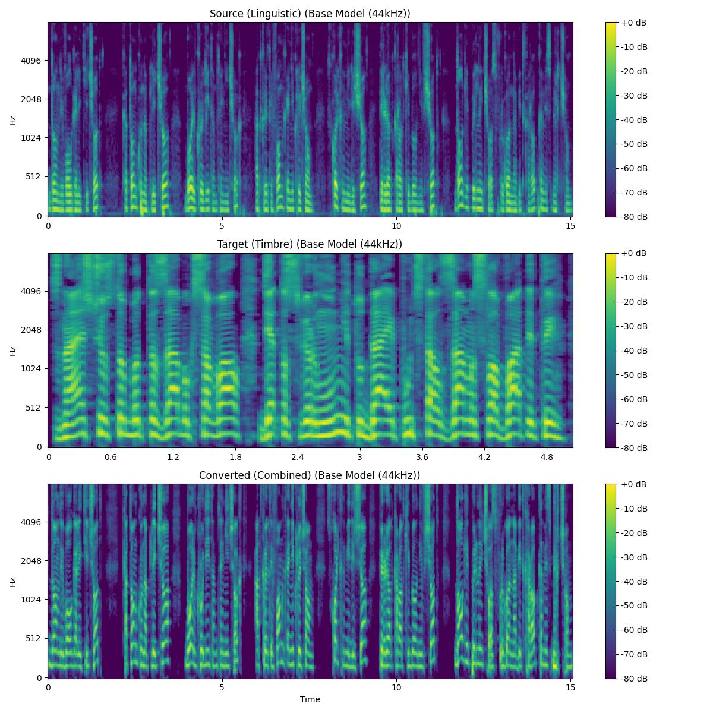
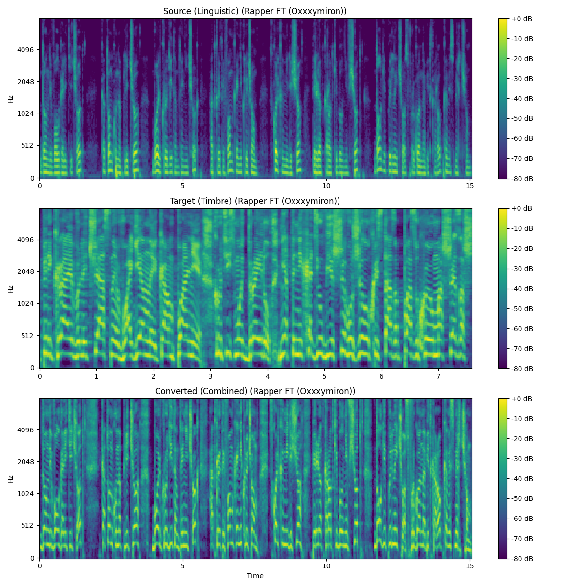

# Appendices: Technical & Visual Supplement

This appendix provides technical diagrams, data flow representations, and visual mockups that support the Seed-VC Real-Time Voice Conversion project.

---

## 🏗️ A. Technical Architecture

The system follows a modular **In-Context Learning** architecture, where the model learns speaker characteristics from a short prompt without retraining.

### Key Components:
- **Whisper/XLSR Tokenizer**: Extracts robust linguistic features (768d) that are speaker-invariant.
- **CAMPPlus Speaker Encoder**: Generates a 192d embedding representing the "voice identity."
- **Diffusion Transformer (DiT)**: A generative backbone that maps linguistic content to the target voice's mel-spectrogram.
- **BigVGAN/HiFT**: High-fidelity neural vocoders that reconstruct the raw audio waveform from frequency data.

---

## 🔄 B. Data Flow (Real-Time Pipeline)

The following diagram illustrates how audio chunks are processed on edge devices like the Jetson Nano to maintain low latency.

---

## 🎨 C. Visual Representations

### 1. Desktop GUI Mockup
The PC-based Desktop GUI (`real-time-gui.py`) provides a feature-rich environment for monitoring and fine-tuning the voice conversion process.

*A mockup of the interface showing the real-time waveform, speaker selection, and latency monitoring.*
(See: `assets/gui_mockup.png`)

### 2. UI Flow
1.  **Selection**: User selects the fine-tuned checkpoint (e.g., Oxxxymiron).
2.  **Configuration**: User sets the buffer size (Block size) and diffusion steps.
3.  **Activation**: User toggles the "Start" button.
4.  **Interaction**: User speaks into the mic; the application visualizes the input and outputs the converted voice immediately.

---

## 📊 D. Quality Metrics & Visualizations

### 1. Mel Spectrogram Comparison
The Mel Spectrogram is the primary representation used by the AI to "see" sound. Effective conversion maintains the horizontal structure (timing/words) of the source while adopting the vertical texture (pitch/timbre) of the reference.

**Automated Generation**: The script `project/evaluation/compare_models.py` automatically generates a 3-panel comparison (Source, Target, Converted) for every model test case.

*Example automated output locations:*

  

  

*Conceptual visual comparison:*
(See: `assets/mel_spectrogram_comparison.png`)

### 2. Performance Benchmarks (Jetson Nano)
| Metric | PyTorch (FP32) | Optimized (FP16 + 3 Steps) |
| :--- | :--- | :--- |
| **Inference Latency** | ~1200ms | ~150ms |
| **Model Size** | ~300 MB | ~150 MB |
| **Real-Time Factor** | 0.8x (Laggy) | 2.5x (Real-time) |

---

## 📂 E. Repository Structure
- `project/minimal_voice_processing_pipeline/`: Core testing ground for component isolation.
- `project/edge_optimization/`: Research on quantization and pruning for Jetson Nano.
- `project/evaluation/`: Scripts for objective PESQ/STOI metrics.
- `project/fine_tuning/`: Tools for creating new custom rapper models.
